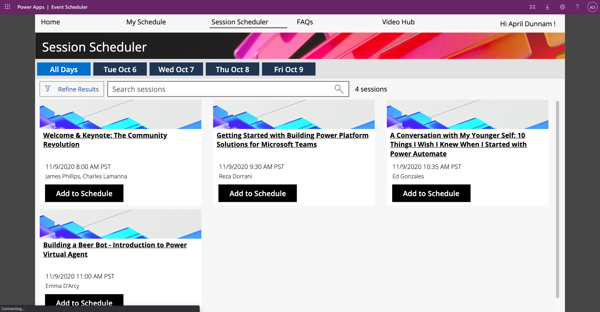

## Conference Scheduler App
This template gives you a complete conference management and scheduling solution.  It include a Canvas application that allows users to browse the agenda, add sessions to their schedule and access presentation recordings and slides.  The Model Driven application gives administrators an easy application to manage the conference including sessions, speakers, faq's and session evaluations.

## Deployment Instructions
1.  Download the ConferenceApp_1_5.zip solution file
2.  Go to make.powerapps.com
3.  Click on the solutions tab
4.  Select "Import Solution"

*If you only want to use the Event Scheduler Canvas App and use your own database, I have provided just the Canvas App for you to download.  You can import the "EventSchedulerAppOnly" zip in Power Apps via the 'Import App' tab and change all the references to your data source.

