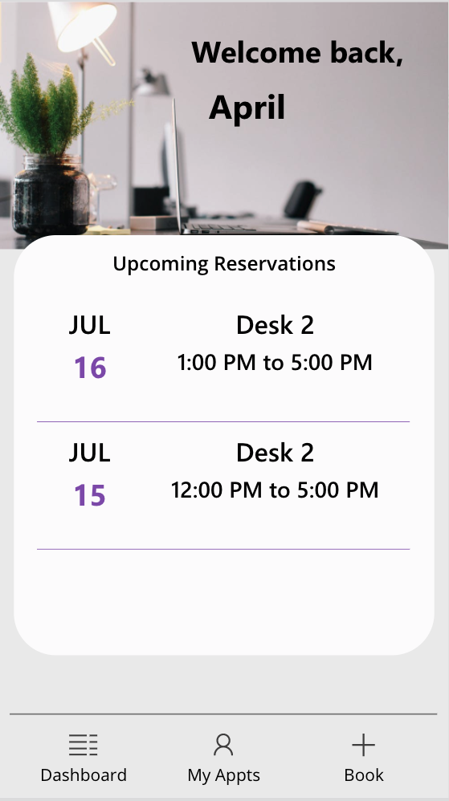

## Desk Booking Template
This Power App allows you to create and manage reservations for desks but it can be modified for any type of reservation scenario.   It's designed to be a mobile app which contains a dashboard page to manage reservations and screens to create a new reservation.

* * *

## Deployment Instructions
1.  Download the Desk Reservation App Zip and the Desk Reservation Provisioner Zip
2.  Go to flow.microsoft.com
3.  Import the Desk Reservation Provisioner Zip into Power Automate
4.  Edit the Action that says "! Enter URL of SP Site to Deploy to here" and put in your SharePoinst site url that you want the underlying list to reside.  Keep note of that site URL.
5. Run the "Desk Reservation Provisioner" Flow. This will create the necessary resources in Sharepoint.
6.  Go to make.powerapps.com
7.  Click on the Apps tabs on the left hand rail
8.  Click 'Import Canvas App' in the ribbon and browse to the Desk Booking App Zip File
9.  Open the app in edit mode.  
10.  Click the data connections tab and delete all of the SharePoint Data Connections in the app
11. Search for SharePoint and add in the new SharePoint lists in your tenant that you just provisioned.

