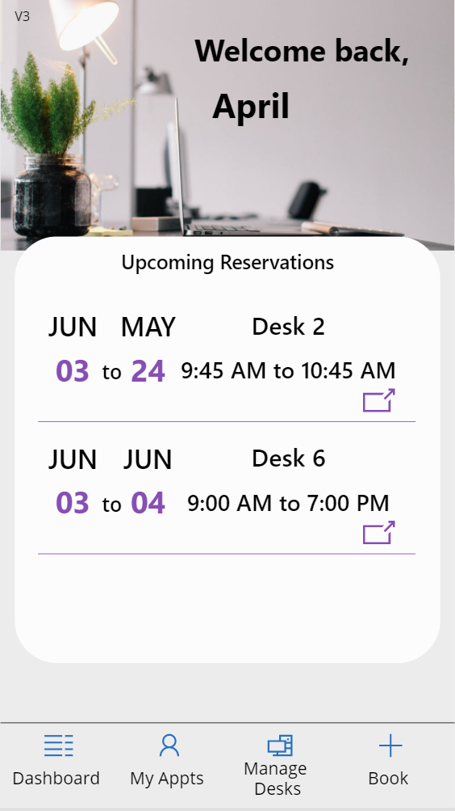
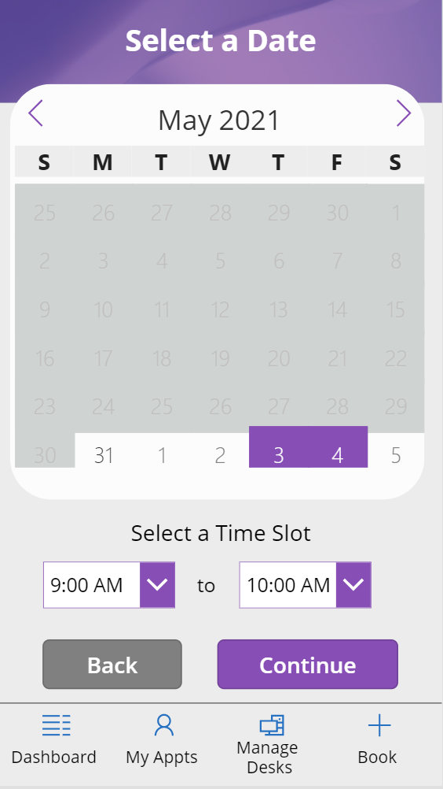
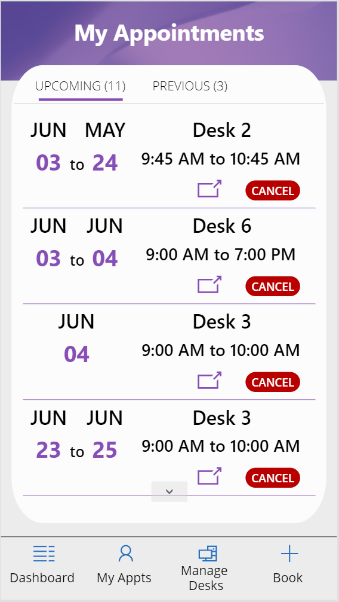
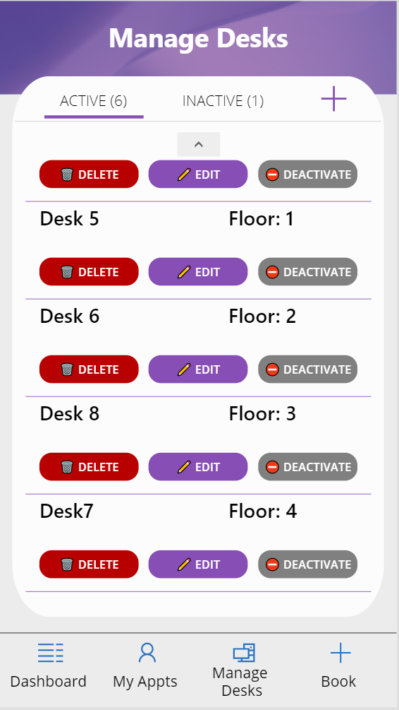

# Desk Reservation App Template

## Summary

This is a fully functional phone-based Canvas Power App template which provides functionality to manage and book desk reservations.  This template can be customzied to meet a variety of booking needs from parking spaces to desks and meeting rooms and more.

You can see an overview of the new features added to this template in this video: [Desk Reservation Template V3](https://youtu.be/JgvQjQsJa80)

## Applies to

* [Microsoft Power Apps](https://docs.microsoft.com/powerapps/)

## Compatibility

## Authors

Solution|Author(s)
--------|---------
Desk Reservation | [April Dunnam](LinkToYourGitHubProfile) ([@aprildunnam](https://twitter.com/aprildunnam)), Microsoft

## Version history

Version|Date|Comments
-------|----|--------
1.0|May 31, 2021|Initial release

## Features

This sample illustrates the following concepts:

* Design patterns, including using the HTML control for additional styling capability
* Utilizing components (calendar, tabs, preloader)
* Multi-screen form process

## Prerequisites

None

## Data Sources

This template uses SharePoint as it's main data source and consists of two different lists.

### Desks List

This SharePoint list contains the information about the desks that people can book.  Set the list up as follows:

|Type|Internal Name|Required|
|---|---|:---:|
|Single line of text|Title|Yes|
|Multiple lines of text|Description|No|
|Hyperlink|Map Link|No|
|Number|Active|No|
|Single line of text|Floor|No|

### Desks Reservations List

This SharePoint list contains the reservation information.  Set the list up as follows:

|Type|Internal Name|Required|
|---|---|:---:|
|Single line of text|Title|Yes|
|Single line of text|DeskText|Yes|
|Person or Group|Reserved By|Yes|
|Date and Time|Check Out From|No|
|Date and Time|Check Out To|No|
|Single line of text|Check Out From Text|No|
|Single line of text|Check Out To Text|No|
|Number|Check Out From Number|No|
|Number|Check Out To Number|No|

## Minimal Path to Awesome

* [Download](./solution/DeskReservation.msapp) the `.msapp` from the `solution` folder
* Within **Power Apps Studio**, use the `.msapp` file using **File** > **Open** > **Browse** and select the `.msapp` file you just downloaded.
* Select the **Data** tab
* Click the "..." next to the Desk Reservations and Desks data connections and select "remove"
* Select "Add Data" and search for SharePoint
* Navigate to the site url that you created the SharePoint lists in an add back in the Desks and Desks Reservations lists

## Using the Source Code

  You can also use the [Power Apps Source Code tool](https://github.com/microsoft/PowerApps-Language-Tooling) to the code using these steps:

* Clone the repository to a local drive
* Pack the source files back into `.msapp` file:
  * [Power Apps Tooling Usage](https://github.com/microsoft/PowerApps-Language-Tooling)
* Within **Power Apps Studio**, use the `.msapp` file using **File** > **Open** > **Browse** and select the `.msapp` file you just packed.

## Disclaimer

**THIS CODE IS PROVIDED *AS IS* WITHOUT WARRANTY OF ANY KIND, EITHER EXPRESS OR IMPLIED, INCLUDING ANY IMPLIED WARRANTIES OF FITNESS FOR A PARTICULAR PURPOSE, MERCHANTABILITY, OR NON-INFRINGEMENT.**

## Support

While we don't support samples, if you encounter any issues while using this sample, you can [create a new issue](https://github.com/pnp/powerapps-samples/issues/new?assignees=&labels=Needs%3A+Triage+%3Amag%3A%2Ctype%3Abug-suspected&template=bug-report.yml&sample=YOURSAMPLENAME&authors=@YOURGITHUBUSERNAME&title=YOURSAMPLENAME%20-%20).

For questions regarding this sample, [create a new question](https://github.com/pnp/powerapps-samples/issues/new?assignees=&labels=Needs%3A+Triage+%3Amag%3A%2Ctype%3Abug-suspected&template=question.yml&sample=YOURSAMPLENAME&authors=@YOURGITHUBUSERNAME&title=YOURSAMPLENAME%20-%20).

Finally, if you have an idea for improvement, [make a suggestion](https://github.com/pnp/powerapps-samples/issues/new?assignees=&labels=Needs%3A+Triage+%3Amag%3A%2Ctype%3Abug-suspected&template=suggestion.yml&sample=YOURSAMPLENAME&authors=@YOURGITHUBUSERNAME&title=YOURSAMPLENAME%20-%20).

## For more information

- [Overview of creating apps in Power Apps](https://docs.microsoft.com/powerapps/maker/)
- [Power Apps canvas apps documentation](https://docs.microsoft.com/en-us/powerapps/maker/canvas-apps/)

