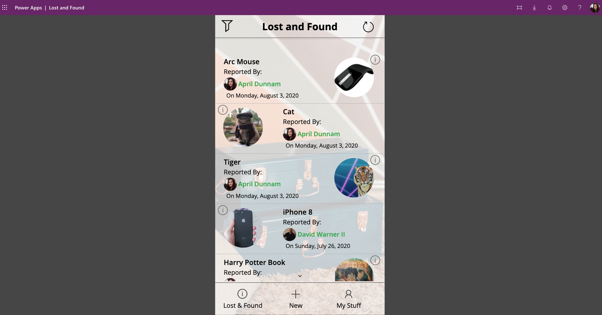

## Lost and Found Templates
This mobile-based Power App gives you a lost and found solution for your organization.

## Deployment Instructions
1.  Download all the zip files in this repo.
2.  Go to flow.microsoft.com
3.  Import the Lost and Found List Provisioner Zip into Power Automate
4.  Run this Flow - when prompted, enter in the URL of the SharePoint site that you want to deploy these lists to.
5.  Go to make.powerapps.com
6.  Click on the Apps tabs on the left hand rail
7.  Click 'Import Canvas App' in the ribbon and browse to the Lost and Found App Zip File
8.  Open the app in edit mode.  
9.  Click the data connections tab and delete all of the SharePoint Data Connections in the app
10. Search for SharePoint and add in the new SharePoint lists in your tenant that you just provisioned.
11. The Power App also deploys a Flow to handle uploading images.  Go to Power Automate and click the Edit button on this Flow.  
12. Expand out the Apply to Each action and for the two SharePoint actions, make sure it's pointing to your SharePoint site URL.  Click save and make sure this Flow is turned on.
13. Go back to the Power App - remove and re-add the Flow.

