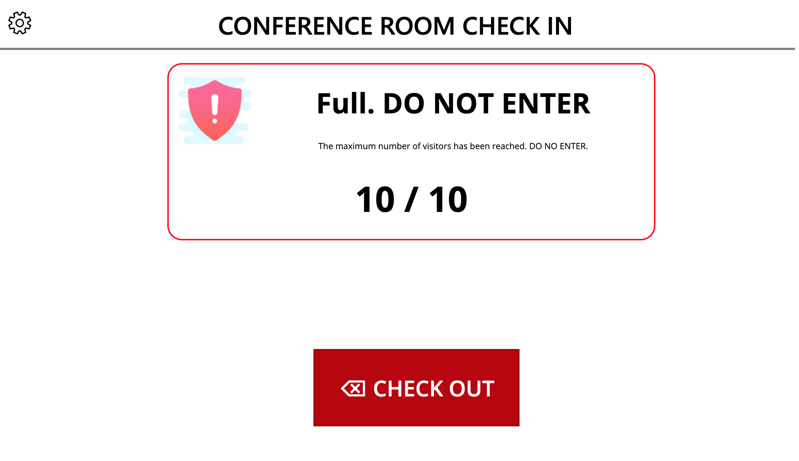

## Occupancy Tracker App
This Power App allows you to track and limit the occupancy of a room.  It's designed to serve as a kiosk type application.  It will show the maximum and current occupants of a room, let you know if it's safe to enter and allow you to check in.  

The app contains a Settings mechanism that can be controled by an administrator to customize the app.  An admin can set up rooms and configure which room to display in the app session.  You can also control options to require check in questions.  

## Deployment Instructions
1.  Download the Occupancy Tracker App Zip and the Occupancy List Set Up Zip
2.  Go to flow.microsoft.com
3.  Import the Occupancy LIst Set Up Zip into Power Automate
4.  Edit the Action that says "! Enter URL of SP Site to Deploy to here" and put in your SharePoinst site url that you want the underlying list to reside.  Keep not of that site URL.
5.  Go to make.powerapps.com
6.  Click on the Apps tabs on the left hand rail
7.  Click 'Import Canvas App' in the ribbon and browse to the Occupancy Tracker Zip File
8.  Open the app in edit mode.  
9.  Click the data connections tab and delete all of the SharePoint Data Connections in the app
10. Search for SharePoint and add in the new SharePoint lists in your tenant that you just provisioned.

