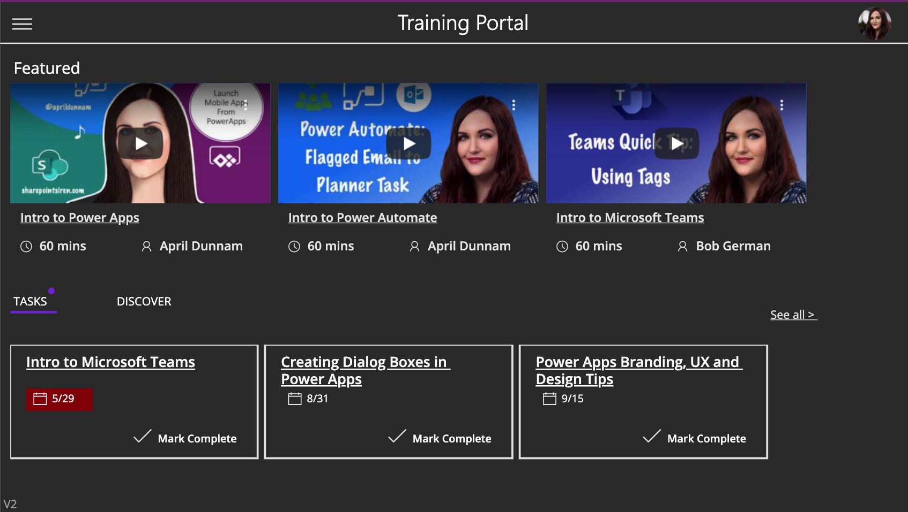

## Required Training Template
This Power App gives you a training portal where you can view different video based training, assign required training to users, and give users a place to see and complete their required training.

## Deployment Instructions
1.  Download the Training Portal App Zip and the Training Portal Provisioner Zip
2.  Go to flow.microsoft.com
3.  Import the Training Portal Provisioner Zip into Power Automate
4.  Make sure the flow is turned on and click Run.  Enter the URL of the SharePoint site you want to deploy the lists to when prompted.
5.  Go to make.powerapps.com
6.  Click on the Apps tabs on the left hand rail
7.  Click 'Import Canvas App' in the ribbon and browse to the Training Portal App Zip 
8.  Open the app in edit mode.  
9.  Click the data connections tab and delete all of the SharePoint Data Connections in the app
10. Search for SharePoint and add in the new SharePoint lists in your tenant that you just provisioned.

