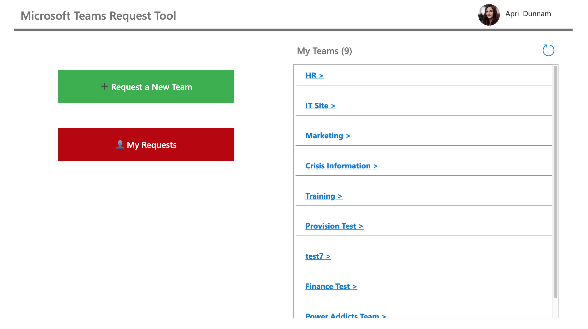

## Teams Provisioning Template
This solution gives you a Power App where you can request a new Teams team.  A flow in Power Automate then kicks off to automatically create the Team according to set up policies that you control via the Power App.  

