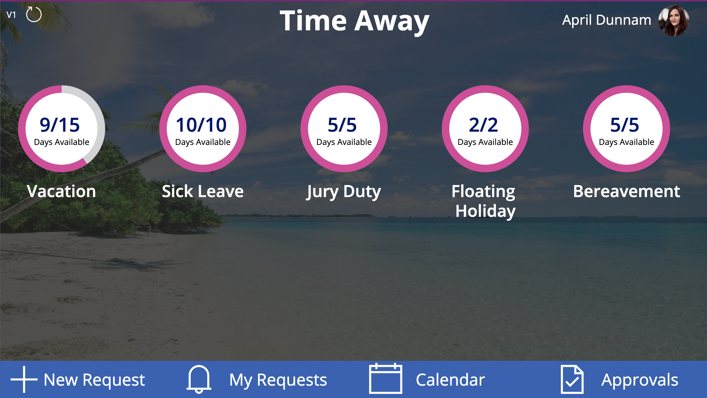

## Time Off Template
This solution allows you to enter requests for time off, see your request history, view your teams vacation schedule on a shared calendar, and approve requests all from one central application.

## Deployment Instructions
1.  Download the Time Off Zip File
2.  Go to make.powerapps.com
3.  Click on the Apps tabs on the left hand rail
4.  Click 'Import Canvas App' in the ribbon and browse to the Time Off App Zip File
5.  Follow the instructions below to create the underlying SharePoint Lists
6.  Once you are done creating the SharePoint lists, remove the data connects in the Power App and re-add them pointing to your lists.

## Time Off Types List
This list holds the list of the types of time off requests you can make

1.  Create a new SharePoint list named 'Time Off Types'
2.  Create a Number column called 'AllottedTime' (there are no spaces!)
3.  Fill in this list with your time off types (Vacation, Jury Duty, Sick Leave, etc)

## Time Off Balances List
This list holds the employee names and their time off balance information.  

1.  Create a new SharePoint list named 'Time Off Balances'
2.  Create a Person column called 'Employee'
3.  Create a Lookup Column to the Time Off Types List called 'TimeOffType'.  Include the Allotted Time in this lookup
4.  Create a Number Field called 'RequestedTimeOff'
5.  Create a Number Field called 'Allotted Time Off'
6.  Create records for each time off type per employee.  

## Time Off Requests List
This list holds the requests for time off

1.  Create a new SharePoint list named 'Time Off Requests'
2.  Create a Date Field called 'From'
3.  Create a Date Field called 'To'
4.  Create a Choice Column called 'TimeOffType'
5.  Create a Number Field called 'Days'
6.  Create a Number Field called 'Hours'
7.  Create a Choice Column called 'Status' with the following values: Pending, Approved, Denied

## Time Off Approvers List
This list holds the list of people who can approve requests.

1.  Create a new SharePoint list named 'TimeOffApprovers'
2.  Create a Single Line of text column called 'Email'
3.  Add records for each person who should have access to approve time off requests.  Put their name in the title field and email in the email field

## Time Off Calendar List
This list holds approved time off requests to show in the shared calendar.

1.  Create a new SharePoint list named 'Time Off Calendar'
2.  Create a Date Field called 'Start'
3.  Create a Date Field called 'End'

