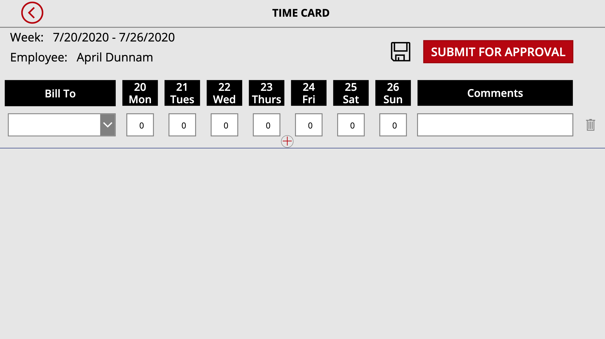

## Timesheet Template
This Power App allows you to manage weekly timesheets. 

## Deployment Instructions
1.  Download the TimesheetApp Zip and the Timesheet Provisioner Zip
2.  Go to flow.microsoft.com
3.  Import the Timesheet Provisioner Zip into Power Automate
4.  Edit the Action that says "! Enter URL of SP Site to Deploy to here" and put in your SharePoinst site url that you want the underlying list to reside.  Keep not of that site URL.
5.  Go to the TimeEntries List and add a Lookup Column called "BillTo" that points to the BillTo Lists Title field.
6.  Go to make.powerapps.com
7.  Click on the Apps tabs on the left hand rail
8.  Click 'Import Canvas App' in the ribbon and browse to the Timesheet App Zip File
9.  Open the app in edit mode.  
10.  Click the data connections tab and delete all of the SharePoint Data Connections in the app
12. Search for SharePoint and add in the new SharePoint lists in your tenant that you just provisioned.

